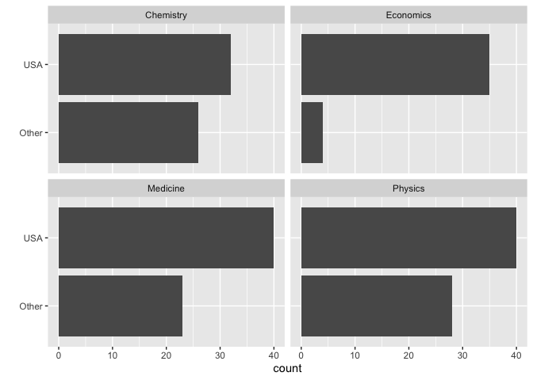

Lab 03 - Nobel laureates
================
Conor Lacey
01/24/23

### Load packages and data

``` r
suppressWarnings(library(tidyverse))
```

``` r
nobel <- read_csv("data/nobel.csv")
```

## Exercises

### Exercise 1

There are 935 observations with 26 variables in the Nobel data set. Each
row represents an individual

### Exercise 2

``` r
nobel_living<-nobel %>% 
  filter(!is.na(country) & 
           gender != "org" &
           is.na(died_date))
```

### Exercise 3

It appears from the bar graphs that most nobel laureates are indeed
living in the US.

``` r
nobel_living <- nobel_living %>%
  mutate(
    country_us = if_else(country == "USA", "USA", "Other")
  )
```

``` r
nobel_living_science <- nobel_living %>%
  filter(category %in% c("Physics", "Medicine", "Chemistry", "Economics"))
```

``` r
nobel_living_science %>% 
  ggplot(aes(y=country_us))+
  facet_wrap(~category)+
  geom_bar()+
  ylab("")
```

<!-- -->

### Exercise 4

…

### Exercise 5

…

### Exercise 6

…
